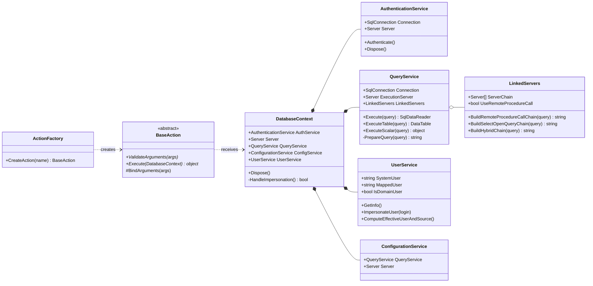
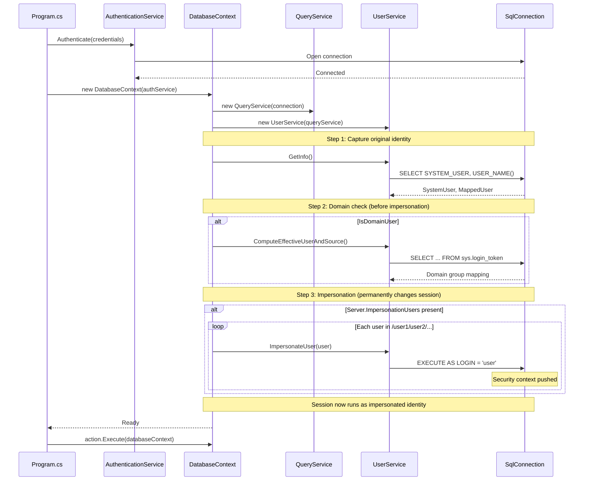
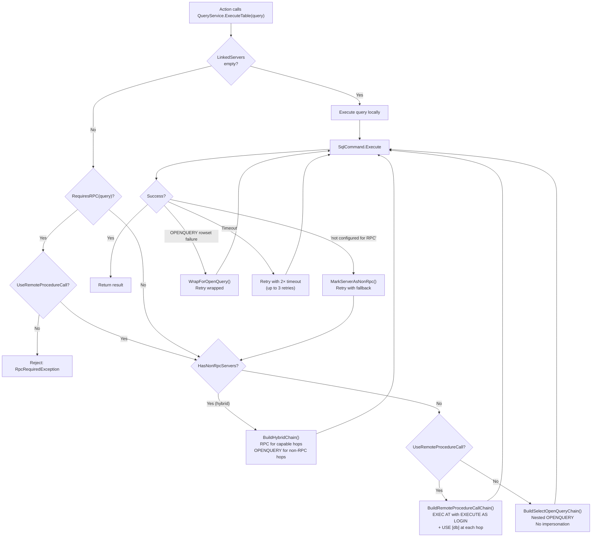

# Development Guide

This guide covers the technical architecture, design principles, security context model, and instructions for extending MSSQLand.

## 📐 Design Principles

MSSQLand follows several key software development principles:

### Single Responsibility Principle (SRP)

Further reading: [Wikipedia - Single-responsibility principle](https://en.wikipedia.org/wiki/Single-responsibility_principle), [Refactoring.Guru - Single Responsibility Principle](https://refactoring.guru/design-patterns/solid-principles#single-responsibility-principle)

Each class should have one, and only one, reason to change. Each action class in the [Actions](MSSQLand/Actions) directory, like [Tables](MSSQLand/Actions/Database/Tables.cs) or [Permissions](MSSQLand/Actions/Database/Permissions.cs), is responsible for a single operation. The [Logger](MSSQLand/Utilities/Logger.cs) class solely handles logging, decoupling it from other logic.

### Open/Closed Principle (OCP)

Further reading: [Wikipedia - Open-closed principle](https://en.wikipedia.org/wiki/Open%E2%80%93closed_principle), [Refactoring.Guru - Open Closed Principle](https://refactoring.guru/design-patterns/solid-principles#open-closed-principle)

Software entities should be open for extension but closed for modification. The [BaseAction](MSSQLand/Actions/BaseAction.cs) abstract class defines a common interface for all actions. New actions can be added by inheriting from it without modifying existing code. The [ActionFactory](MSSQLand/Actions/ActionFactory.cs) enables seamless addition of new actions by simply registering them in the dictionary.

### Liskov Substitution Principle (LSP)

Further reading: [Wikipedia - Liskov substitution principle](https://en.wikipedia.org/wiki/Liskov_substitution_principle), [Refactoring.Guru - Liskov Substitution Principle](https://refactoring.guru/design-patterns/solid-principles#liskov-substitution-principle)

Subtypes should be substitutable for their base types without altering program behavior. The [BaseAction](MSSQLand/Actions/BaseAction.cs) class ensures all derived actions (e.g., Tables, Permissions, Smb) can be used interchangeably, provided they implement `Execute`. Similarly, all credential types ([TokenCredentials](MSSQLand/Services/Authentication/Credentials/TokenCredentials.cs), [WindowsCredentials](MSSQLand/Services/Authentication/Credentials/WindowsCredentials.cs), [LocalCredentials](MSSQLand/Services/Authentication/Credentials/LocalCredentials.cs), etc.) extend [BaseCredentials](MSSQLand/Services/Authentication/Credentials/BaseCredentials.cs) and are interchangeable in [`AuthenticationService`](MSSQLand/Services/Authentication/AuthenticationService.cs).

### DRY (Don't Repeat Yourself)

Further reading: [Wikipedia - Don't repeat yourself](https://en.wikipedia.org/wiki/Don%27t_repeat_yourself), [DevIQ - DRY Principle](https://deviq.com/principles/dont-repeat-yourself)

Avoid duplicating logic across the codebase. The [QueryService](MSSQLand/Services/QueryService.cs) centralizes query execution, avoiding repetition in individual actions. Argument parsing is handled once in `BaseAction.BindArguments()` via reflection rather than duplicated in every action.

### KISS (Keep It Simple, Stupid)

Further reading: [Wikipedia - KISS principle](https://en.wikipedia.org/wiki/KISS_principle)

Systems should be as simple as possible but no simpler. Complex linked server queries and impersonation are abstracted into services, simplifying their usage.

### Composition over Inheritance

Further reading: [Wikipedia - Composition over inheritance](https://en.wikipedia.org/wiki/Composition_over_inheritance), [Refactoring.Guru - Favor Composition Over Inheritance](https://refactoring.guru/favor-composition-over-inheritance)

Prefer composing objects over deep inheritance hierarchies. [`DatabaseContext`](MSSQLand/Services/DatabaseContext.cs) composes [`QueryService`](MSSQLand/Services/QueryService.cs), [`UserService`](MSSQLand/Services/UserService.cs), [`ConfigurationService`](MSSQLand/Services/ConfigurationService.cs), and [`AuthenticationService`](MSSQLand/Services/Authentication/AuthenticationService.cs) into a single facade. Actions receive a `DatabaseContext` and access whichever service they need, without knowing about the others.

### Command Pattern

Further reading: [Wikipedia - Command pattern](https://en.wikipedia.org/wiki/Command_pattern), [Refactoring.Guru - Command](https://refactoring.guru/design-patterns/command)

Each action is a command object: [BaseAction](MSSQLand/Actions/BaseAction.cs) defines `ValidateArguments()` to configure the command and `Execute()` to run it. The [ActionFactory](MSSQLand/Actions/ActionFactory.cs) instantiates the right command from user input, [`Program.cs`](MSSQLand/Program.cs) validates it, then executes it, decoupling invocation from execution.

### Strategy Pattern

Further reading: [Wikipedia - Strategy pattern](https://en.wikipedia.org/wiki/Strategy_pattern), [Refactoring.Guru - Strategy](https://refactoring.guru/design-patterns/strategy)

Swappable implementations behind a common interface. [`IOutputFormatter`](MSSQLand/Utilities/Formatters/IOutputFormatter.cs) allows switching between [MarkdownFormatter](MSSQLand/Utilities/Formatters/MarkdownFormatter.cs) and [CsvFormatter](MSSQLand/Utilities/Formatters/CsvFormatter.cs) at runtime via [`OutputFormatter`](MSSQLand/Utilities/Formatters/OutputFormatter.cs)`.SetFormat()`. The [CredentialsFactory](MSSQLand/Services/Authentication/Credentials/CredentialsFactory.cs) registry maps credential type names to factory lambdas, each producing a different [BaseCredentials](MSSQLand/Services/Authentication/Credentials/BaseCredentials.cs) strategy. Query routing in [LinkedServers](MSSQLand/Models/LinkedServers.cs) selects between RPC (`EXEC AT`) and OPENQUERY strategies per hop.

### Declarative Configuration via Attributes

Further reading: [Microsoft Learn - Attributes in C#](https://learn.microsoft.com/en-us/dotnet/csharp/advanced-topics/reflection-and-attributes/), [Wikipedia - Reflection (computer programming)](https://en.wikipedia.org/wiki/Reflective_programming)

Action arguments are defined declaratively using [`[ArgumentMetadata]`](MSSQLand/Actions/ArgumentMetadataAttribute.cs) attributes on fields, specifying position, short/long names, required flag, and description. `BaseAction.BindArguments()` uses reflection to automatically parse, convert, and bind CLI arguments to these fields. [`[ExcludeFromArguments]`](MSSQLand/Actions/ExcludeFromArgumentsAttribute.cs) marks internal fields that should be skipped during binding. This eliminates boilerplate argument parsing from every action.

### Deterministic Resource Management

Further reading: [Microsoft Learn - Implement a Dispose method](https://learn.microsoft.com/en-us/dotnet/standard/garbage-collection/implementing-dispose), [Wikipedia - RAII](https://en.wikipedia.org/wiki/Resource_acquisition_is_initialization)

[`DatabaseContext`](MSSQLand/Services/DatabaseContext.cs) implements `IDisposable` for deterministic cleanup of the `SqlConnection` session. [`Program.cs`](MSSQLand/Program.cs) wraps it in a `using` block, ensuring the connection is always closed even if an action throws.


## 🏗️ Architecture

MSSQLand is built on a clean, OOP-driven architecture designed for extensibility:

- **Modular Actions**: Each action is a self-contained class inheriting from [BaseAction](MSSQLand/Actions/BaseAction.cs)
- **Factory Pattern**: Actions are automatically discovered and instantiated via [ActionFactory](MSSQLand/Actions/ActionFactory.cs)
- **[Service Layer](MSSQLand/Services)**: Separation of concerns with [`DatabaseContext`](MSSQLand/Services/DatabaseContext.cs), [`QueryService`](MSSQLand/Services/QueryService.cs), [`UserService`](MSSQLand/Services/UserService.cs), and [`AuthenticationService`](MSSQLand/Services/Authentication/AuthenticationService.cs)
- **Credential Abstraction**: Multiple authentication methods through [CredentialsFactory](MSSQLand/Services/Authentication/Credentials/CredentialsFactory.cs) (Token, Domain, Local, Azure, Entra ID, Windows Auth)
- **Chainable Operations**: Built-in support for linked server traversal and user impersonation chaining



---

## 🔐 Security Context Model

A core design decision in MSSQLand is that **impersonation, linked server traversal, and database context are unified**, not separate execution modes. Understanding how the security context flows through the system is essential for working on the codebase.

### Connection Lifecycle

MSSQLand uses `System.Data.SqlClient.SqlConnection`, which represents a [unique session](https://learn.microsoft.com/en-us/dotnet/api/system.data.sqlclient.sqlconnection) to SQL Server. A single `SqlConnection` is opened at startup and reused for the entire execution; every `SqlCommand` created from it runs within the same server-side session.

SQL Server maintains an **execution context stack** per session. When [`EXECUTE AS LOGIN`](https://learn.microsoft.com/en-us/sql/t-sql/statements/execute-as-transact-sql) is issued, it pushes a new security context onto this stack. From that point on, all permission checks use the impersonated principal's security tokens instead of the original caller's. The context persists until `REVERT` is called, another `EXECUTE AS` is issued, or the session ends. Multiple `EXECUTE AS` calls stack, each one nesting deeper.

Because MSSQLand shares a single `SqlConnection` across all services and actions, an `EXECUTE AS LOGIN` issued during connection setup permanently changes who every subsequent query runs as. This is why the ordering inside [`DatabaseContext`](MSSQLand/Services/DatabaseContext.cs) is critical:



1. **Authentication**: [`AuthenticationService`](MSSQLand/Services/Authentication/AuthenticationService.cs) establishes the SQL connection
2. **GetInfo()**: [`UserService`](MSSQLand/Services/UserService.cs)`.GetInfo()` captures the pre-impersonation identity (`SystemUser`, `MappedUser`)
3. **Domain check**: `ComputeEffectiveUserAndSource()` runs before impersonation because `sys.login_token` is unavailable after `EXECUTE AS`
4. **Impersonation**: [`DatabaseContext`](MSSQLand/Services/DatabaseContext.cs)`.HandleImpersonation()` iterates over [`Server`](MSSQLand/Models/Server.cs)`.ImpersonationUsers` and issues sequential `EXECUTE AS LOGIN` statements on the live connection

This order matters. After step 4, the `SqlConnection` session permanently operates under the impersonated identity. All subsequent `SqlCommand` executions (including those sent through linked servers) run as the impersonated user, because SQL Server checks permissions against the session's current execution context, not the original login.

### Cascading Impersonation on the Initial Server

The [`Server`](MSSQLand/Models/Server.cs) model carries an `ImpersonationUsers` array (parsed from the `/user1/user2` notation). In [`DatabaseContext`](MSSQLand/Services/DatabaseContext.cs)`.HandleImpersonation()`, each user is impersonated in sequence:

```
EXECUTE AS LOGIN = 'user1';   -- pushes user1 onto the security stack
EXECUTE AS LOGIN = 'user2';   -- from user1's context, pushes user2
```

Each `EXECUTE AS LOGIN` pushes a new security context onto SQL Server's internal stack. The final identity is `user2`, but the chain `user1 → user2` must be valid: `user1` must have permission to impersonate `user2`. This is how you escalate through chains of trust that no single hop could traverse.

### Impersonation on Linked Server Hops

Each server in the linked chain ([`LinkedServers`](MSSQLand/Models/LinkedServers.cs)`.ServerChain`) carries its own `ImpersonationUsers` array. When [`QueryService`](MSSQLand/Services/QueryService.cs)`.PrepareQuery()` builds the final SQL, it delegates to [`LinkedServers`](MSSQLand/Models/LinkedServers.cs)`.BuildRemoteProcedureCallChain()` which injects `EXECUTE AS LOGIN` statements at each hop:

```sql
-- Chain: SQL01 → SQL02/admin → SQL03/user1/user2@clientdb
EXEC ('EXECUTE AS LOGIN = ''admin''; EXEC (''EXECUTE AS LOGIN = ''''user1''''; EXECUTE AS LOGIN = ''''user2''''; USE [clientdb]; SELECT ....'') AT [SQL03]') AT [SQL02]
```

The `BuildRemoteProcedureCallRecursive` method in [`LinkedServers`](MSSQLand/Models/LinkedServers.cs) loops from innermost server to outermost. At each hop, it:
1. Prepends `EXECUTE AS LOGIN` for each impersonation user (cascading)
2. Prepends `USE [database]` if a database context is specified
3. Appends the query (with single quotes doubled for SQL escaping at each nesting level)
4. Wraps everything in `EXEC ('...') AT [server]`

This means impersonation at hop N happens *inside* the `EXEC AT` boundary of hop N, so it runs on that linked server under that server's security context.

### RPC vs OPENQUERY

Two mechanisms exist for executing queries on linked servers:

- **RPC (`EXEC AT`)**: Executes arbitrary SQL statements including `EXECUTE AS LOGIN`, `USE`, `sp_configure`, `xp_cmdshell`. Requires RPC Out enabled on the linked server.
- **OPENQUERY**: Read-only queries that return a rowset. Cannot execute `EXECUTE AS LOGIN`, server-level commands, or statements that don't return rows.

MSSQLand prefers RPC because it supports impersonation and server-level operations. If a linked server lacks RPC, [`QueryService`](MSSQLand/Services/QueryService.cs) automatically falls back to OPENQUERY for that specific hop (hybrid routing), while keeping RPC for hops that support it. This is tracked per-server via [`LinkedServers`](MSSQLand/Models/LinkedServers.cs)`._nonRpcServers`.



**Important**: Impersonation via `EXECUTE AS LOGIN` is incompatible with OPENQUERY. When a hop falls back to OPENQUERY, impersonation for that hop is silently skipped with a warning. This is a SQL Server limitation, not a design choice.

### How Actions Interact With Context

Actions receive a [`DatabaseContext`](MSSQLand/Services/DatabaseContext.cs) and call [`QueryService`](MSSQLand/Services/QueryService.cs)`.ExecuteTable(query)` (or `ExecuteScalar`, `Execute`, etc.). They never need to know whether impersonation or linked servers are active; the [`QueryService`](MSSQLand/Services/QueryService.cs)`.PrepareQuery()` pipeline transparently wraps their raw SQL with the correct nesting. An action written for a direct connection works identically through a five-hop linked server chain with cascading impersonation at each hop.

---

## 📁 Project Structure

```
MSSQLand/
├── Actions/          # All action implementations
│   ├── Administration/
│   ├── ConfigMgr/
│   ├── Database/
│   ├── Domain/
│   ├── Execution/
│   ├── FileSystem/
│   └── Remote/
├── Services/         # Core services (DB, Auth, etc.)
├── Models/           # Data models
├── Utilities/        # Helper classes
└── Exceptions/       # Custom exceptions
```

### Directory Descriptions

#### [Models](MSSQLand/Models)

Contains classes representing SQL Server entities, such as [`Server`](MSSQLand/Models/Server.cs) and [`LinkedServers`](MSSQLand/Models/LinkedServers.cs).

#### [Services](MSSQLand/Services)

The backbone of the application, responsible for connection management, query execution, user management, and configuration handling.

#### [Actions](MSSQLand/Actions)

This directory contains all the specific operations that MSSQLand can perform. Each action follows a modular design using the command pattern to encapsulate its logic, such as PowerShell execution, querying, impersonation, and more.

#### [Utilities](MSSQLand/Utilities)

Helper classes like [`Logger`](MSSQLand/Utilities/Logger.cs) and [`MarkdownFormatter`](MSSQLand/Utilities/Formatters/MarkdownFormatter.cs) that make your life easier.

---

## 🎬 Adding a New Action

This design makes adding new features straightforward: simply create a new action class, and the framework handles the rest.

### Step 1: Choose the Right Directory

Depending on your new feature, create a new action class inside the appropriate subdirectory:

- `Actions/Administration/` - Server management, sessions, monitoring
- `Actions/Database/` - Database operations, queries, permissions
- `Actions/Domain/` - Active Directory interactions
- `Actions/Execution/` - Command execution, scripts
- `Actions/FileSystem/` - File operations
- `Actions/Remote/` - Linked servers, RPC, ADSI
- `Actions/ConfigMgr/` - Configuration Manager operations

### Step 2: Create Your Action Class

Copy-paste this skeleton and customize:

```csharp
// MSSQLand/Actions/Database/NewAction.cs

using MSSQLand.Services;
using MSSQLand.Utilities;
using MSSQLand.Utilities.Formatters;
using System;
using System.Data;

namespace MSSQLand.Actions.Database
{
    internal class NewAction : BaseAction
    {
        /// <summary>
        /// Arguments are automatically bound via reflection using [ArgumentMetadata].
        /// Supports positional args, short names (-a), and long names (--argument).
        /// Fields must have default values for .NET Framework 4.8 compatibility.
        /// </summary>
        [ArgumentMetadata(Position = 0, ShortName = "a", LongName = "argument", Required = true, Description = "Describe what this argument does")]
        private string _argument = "";

        [ArgumentMetadata(Position = 1, ShortName = "c", LongName = "count", Required = false, Description = "Optional count parameter")]
        private int _count = 10;

        /// <summary>
        /// Use [ExcludeFromArguments] for internal fields that should not be parsed from CLI.
        /// </summary>
        [ExcludeFromArguments]
        private string _privateVariable = "";

        // Note: No need to override ValidateArguments() for simple cases.
        // BaseAction.ValidateArguments() automatically calls BindArguments() which:
        //   1. Parses positional and named arguments
        //   2. Binds them to fields decorated with [ArgumentMetadata]
        //   3. Converts types automatically (string, int, bool, enum)
        //   4. Throws MissingRequiredArgumentException for missing required args
        //
        // Override ValidateArguments() only for custom validation logic:
        //
        // public override void ValidateArguments(string[] args)
        // {
        //     BindArguments(args);  // Always call base binding first
        //     
        //     // Add custom validation
        //     if (_count < 0)
        //         throw new ArgumentException("Count must be positive");
        // }

        public override object Execute(DatabaseContext databaseContext)
        {
            // Log the action being performed
            Logger.TaskNested($"Performing action with argument: {_argument}, count: {_count}");

            // Your T-SQL query
            string query = @"
                SELECT TOP (@count)
                    column1,
                    column2
                FROM sys.some_table
                WHERE condition = @param;";

            try
            {
                // Execute query and get results
                DataTable result = databaseContext.QueryService.ExecuteTable(query);

                if (result.Rows.Count == 0)
                {
                    Logger.Warning("No results found.");
                    return null;
                }

                // Display results
                Console.WriteLine(OutputFormatter.ConvertDataTable(result));
                
                // Log success
                Logger.Success($"Action completed successfully. Retrieved {result.Rows.Count} row(s).");

                return result;
            }
            catch (Exception ex)
            {
                Logger.Error($"Error executing action: {ex.Message}");
                return null;
            }
        }
    }
}
```

