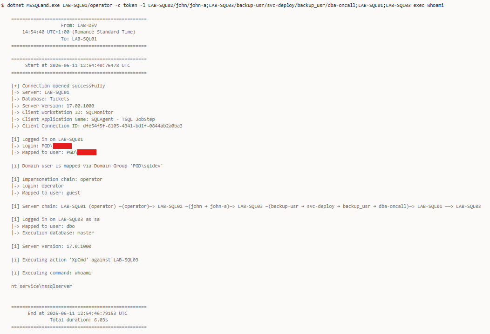

# ✈️ MSSQLand

Land gracefully in your target Microsoft SQL Server (MS SQL) DBMS, as if arriving on a business-class flight with a champagne glass in hand. 🥂



MSSQLand is built for interacting with [Microsoft SQL Server](https://en.wikipedia.org/wiki/Microsoft_SQL_Server) database management system (DBMS) during your red team activities or any security audit. Designed to run inside the target environment directly through your beacons (e.g., using assembly execution), it allows you to pave your way across multiple linked servers and impersonate whoever you can along the way, emerging from the last hop with any desired action.

> [!TIP]
> MSSQLand is built using `.NET Framework 4.8`, with assembly execution in mind, using current context. If you need to connect using NT/LM hashes or a Kerberos ticket, see [Pass-the-Hash](#-pass-the-hash).

> [!NOTE]
> Do not forget the basics. During a security assessment, it is sometimes easier to use [SQL Server Management Studio (SSMS)](https://learn.microsoft.com/en-us/ssms/).

## 🧸 Usage

```shell
MSSQLand.exe <host> -c <cred> [options] <action> [action-options]
MSSQLand.exe <host> --probe
```

> [!NOTE]
> Omitting `<action>` performs a connection test only. It authenticates and exits without running queries. Ideal for credential validation with minimal OPSEC footprint.

> [!TIP]
> Avoid typing out all the **[RPC Out](https://learn.microsoft.com/fr-fr/sql/t-sql/functions/openquery-transact-sql)** or **[OPENQUERY](https://learn.microsoft.com/fr-fr/sql/t-sql/functions/openquery-transact-sql)** calls manually. Let the tool handle any linked servers chain with the `-l` argument, so you can focus on the big picture.

Format: `server:port/user@database` or any combination `server/user@database:port`.
- `server` (required) - The SQL Server hostname or IP
- `:port` (optional) - Port number (default: 1433, also common: 1434, 14333, 2433)
- `/user` (optional) - User to impersonate on this server ("execute as login")
  - Supports **cascading impersonation**: `/user1/user2/user3` executes `EXECUTE AS LOGIN = 'user1'; EXECUTE AS LOGIN = 'user2'; EXECUTE AS LOGIN = 'user3';`
  - Each `/user` pushes a new impersonation context onto the security stack
- `@database` (optional) - Database context

```shell
# Connectivity probe — checks if server is alive without authenticating
MSSQLand.exe localhost --probe

# Connection test only (no action executed, authenticates and exits)
MSSQLand.exe localhost -c token

# Execute specific action
MSSQLand.exe localhost -c token info
MSSQLand.exe localhost:1434@db03 -c token info
MSSQLand.exe LAB-SQL01@AdventureWorks -c token tables -n Customer
```

### 🔗 Linked Servers Chain

Chain multiple SQL servers using the `-l` flag with **semicolon (`;`) as the separator**:

```shell
-l SQL01;SQL02/user;SQL03@database
```

**Syntax:**
- **Semicolon (`;`)** - Separates servers in the chain
- **Forward slash (`/`)** - Specifies user to impersonate ("execute as login")
  - Supports **cascading impersonation**: `/user1/user2` executes sequential impersonations
- **At sign (`@`)** - Specifies database context
- **Brackets (`[...]`)** - Used to protect the server name from being split by our delimiters

**Examples:**
```shell
# Simple chain
-l SQL01;SQL02;SQL03

# With impersonation and databases
-l SQL01/admin;SQL02;SQL03/manager@clients

# Cascading impersonation (impersonate user1, then user2 on SQL01)
-l SQL01/user1/user2;SQL02;SQL03

# Mixed cascading (SQL01: user1→user2, SQL03: user3→user4→user5)
-l SQL01/user1/user2;SQL02;SQL03/user3/user4/user5@database

# Server names can contain hyphens, dots (no brackets needed)
-l SQL-01;SERVER.001;HOST.DOMAIN.COM

# Brackets only needed if server name contains delimiter characters
-l [SERVER;PROD];SQL02;[SQL03@clients]@clientdb
```

> [!NOTE]
> Port specification (`:port`) only applies to the initial host connection. Linked server chains (`-l`) use the linked server names as configured in `sys.servers`, not `hostname:port` combinations.

## 🔍 Discovery

These modes require no authentication and work before you have credentials.

### Browsing Service

The [SQL Server Browser service](https://learn.microsoft.com/en-us/sql/tools/configuration-manager/sql-server-browser-service) listens on **UDP 1434** and responds to discovery requests with the list of SQL Server instances running on a host, including their names, versions, and TCP ports. This is useful when the target is running named instances on dynamic ports, no need to guess or scan.

```shell
# Query the SQL Browser service on a specific host (UDP 1434)
MSSQLand.exe LAB-SQL03 --browse
```

### LDAP Queries

Active Directory exposes SQL Server registrations through [Service Principal Names (SPNs)](https://learn.microsoft.com/en-us/sql/database-engine/configure-windows/register-a-service-principal-name-for-kerberos-connections) stored on computer and service accounts. MSSQLand queries AD via LDAP for `MSSQLSvc/*` SPNs to enumerate SQL Server instances across the domain, or the entire forest via the [Global Catalog](https://learn.microsoft.com/en-us/windows-server/identity/ad-ds/plan/planning-global-catalog-server-placement).

```shell
# Find SQL Servers in Active Directory via LDAP (current domain)
MSSQLand.exe --findsql

# Target a specific domain
MSSQLand.exe --findsql pgd.lab

# Forest-wide search via Global Catalog (port 3268)
MSSQLand.exe --findsql pgd.lab --gc
```

Discovery is multi-layered. See [FindSqlServers.cs](MSSQLand/Utilities/Discovery/FindSqlServers.cs) for more details.

### Broadcast

SQL Server Browser also responds to [UDP broadcast packets](https://learn.microsoft.com/en-us/sql/tools/configuration-manager/sql-server-browser-service#using-sql-server-browser) on **UDP 1434**, allowing discovery of all SQL Server instances advertising themselves on the local subnet.

```shell
# Broadcast discovery on the local network (UDP 1434)
MSSQLand.exe --broadcast
MSSQLand.exe --broadcast --timeout 5
```

> [!TIP]
> This is particularly useful when a SQL Server is running on a machine that is **not domain-joined** and therefore won't appear in any LDAP or SPN query. Think standalone servers, developer machines, or rogue instances spun up on an internal VLAN.

### Port Scan

Validates open ports against live SQL Server instances using [TDS protocol](https://learn.microsoft.com/en-us/openspecs/windows_protocols/ms-tds/b46a581a-39de-4745-b076-ec4dbb7d13ec) handshakes (not just TCP SYN). A port is only reported if it responds to a TDS pre-login packet.

```shell
MSSQLand.exe LAB-SQL03 --portscan
MSSQLand.exe LAB-SQL03 --portscan --all           # Find all instances (full ephemeral range)
MSSQLand.exe LAB-SQL03 --portscan 65184           # Single port
MSSQLand.exe LAB-SQL03 --portscan 65180-65190     # Port range
MSSQLand.exe LAB-SQL03 --portscan 1433,5000,65184 # Comma-separated list
```

## 🔑 Pass-the-Hash

MSSQLand runs as a .NET assembly inside a beacon and always authenticates using the **current execution context** (`-c token`). When you have a hash, the right approach is to forge a token at the beacon level first and then run MSSQLand normally. `System.Data.SqlClient` inherits that token transparently, and no custom TDS implementation is required.

Implementing NTLMv2 from scratch inside MSSQLand would mean:
- Replacing `System.Data.SqlClient` with a hand-rolled TDS 7.x stack (too much lines of socket, TLS, and NTLM code).
- Maintaining that implementation against SQL Server version quirks, TLS policy changes, and token-stream edge cases.
- Gaining no functional advantage over the token approach in the vast majority of engagements

If you need to authenticate with a Kerberos ticket or NT/LM hashes from an external position, [mssqlclient-ng](https://github.com/n3rada/mssqlclient-ng) is the right tool. This is a Python 3 client built for Unix-side access, trivially paired with a SOCKS5 proxy established from your beacon.

## 🫤 Help

- `-h` or `--help` - Show all available actions
- `-h search_term` - Filter actions (e.g., `-h adsi` shows all ADSI-related actions)
- `localhost -c token createuser -h` - Show detailed help for a specific action

## 🔧 Configuration Manager (ConfigMgr) Support

MSSQLand includes comprehensive support for **[Microsoft Configuration Manager](https://learn.microsoft.com/fr-fr/intune/configmgr/)** (formerly SCCM / MECM) exploitation and reconnaissance. When you have access to a ConfigMgr database server, you can leverage specialized actions for device intelligence (e.g., `cm-devices`) or infrastructure mapping.

All ConfigMgr actions use the `cm-` prefix (e.g., `cm-scripts`, `cm-package`) to align with Microsoft's [official PowerShell cmdlet](https://learn.microsoft.com/en-us/powershell/module/configurationmanager/?view=sccm-ps) naming convention (`Get-CM*`, `Set-CM*`, etc.).

## 📸 Clean Output for Clean Reports

The tool's output, enriched with timestamps and valuable contextual information, is designed to produce visually appealing and professional results, making it ideal for capturing high-quality screenshots for any of your reports (e.g., customer deliverable, internal report, red team assessments).

All output tables are Markdown-friendly and can be copied and pasted directly into your notes without any formatting hassle.

> [!TIP]
> You can also have `.csv` compatible output by using the `--format csv` option: `MSSQLand.exe localhost -c token --format csv --silent procedures > procedures.csv`

## 🤝 Contributing 

Contributions are welcome and appreciated! Whether it's fixing bugs, adding new features, improving the documentation, or sharing feedback, your effort is valued and makes a difference.
Open-source thrives on collaboration and recognition. Contributions, large or small, help improve the tool and its community. Your time and effort are truly valued. 

Here, no one will be erased from Git history. No fear to have here. No one will copy-paste your code without adhering to the collaborative ethos of open-source.

Please see the [CONTRIBUTING.md](./CONTRIBUTING.md) for detailed guidelines on how to get started.

## 🥚 Origin

If you wonder why this exist and not as contibution to other SQL Servers project, see [ORIGIN.md](./ORIGIN.md).

## ⚠️ Disclaimer

**This tool is provided strictly for defensive security research, education, and authorized penetration testing.** You must have **explicit written authorization** before running this software against any system you do not own.

This tool is designed for educational purposes only and is intended to assist security professionals in understanding and testing the security of SQL Server environments in authorized engagements.

Acceptable environments include:
- Private lab environments you control (local VMs, isolated networks).  
- Sanctioned learning platforms (CTFs, Hack The Box, OffSec exam scenarios).  
- Formal penetration-test or red-team engagements with documented customer consent.

Misuse of this project may result in legal action.

## ⚖️ Legal Notice
Any unauthorized use of this tool in real-world environments or against systems without explicit permission from the system owner is strictly prohibited and may violate legal and ethical standards. The creators and contributors of this tool are not responsible for any misuse or damage caused.

Use responsibly and ethically. Always respect the law and obtain proper authorization.
